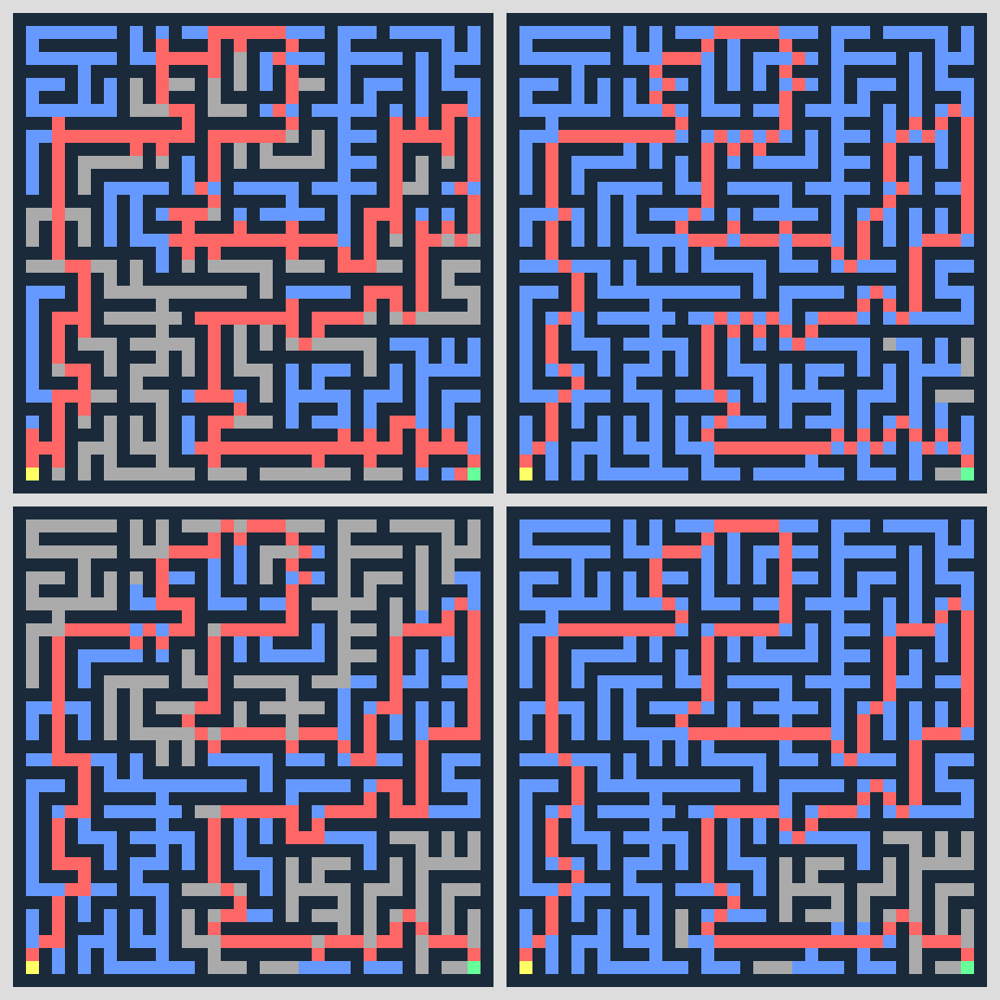

# Pathfinder
Python maze solver (DFS, BFS, Best-first and A\*) with animation!

## Requirements
- `OpenCV on Wheels` - Install it via `pip3 install opencv-python`.
- `NumPy` - Install it via `pip3 install numpy`.
- `ffmpeg` - On Linux, search for `ffmpeg` in your package manager. For Windows and macOS, download the executable from [here](https://ffmpeg.zeranoe.com/builds). The script runs the `ffmpeg` command on the terminal, so that's what needs to be working for the animation to be generated.

## Usage
Run it with `python3 pathfinder.py (-f FILE) [-h] [-a [-l LENGTH]]`.

- `-f FILE` - filename of the maze to be solved 
- `-h` - shows a help message and exits (optional)
- `-a` - outputs an animation showing all paths (optional)
- `-l LENGTH` - length of the animation, in seconds \| Default: 15 (optional)

## Examples
The [testcases](testcases/) directory has some example mazes and their animations generated by the application. The animations show a 2x2 grid. Starting from the upper left and going clockwise: Depth-first Search, Breadth-first Search, Best-first Search, A* Search.

Try running `python3 pathfinder.py -f testcases/maze-6.txt -a`!

Last frame of `testcases/maze-6-all.mp4`:

